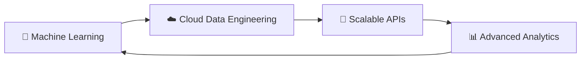

# 👋 Hi, I'm Ayush Upadhyay

### 🚀 Data Analyst | Backend Developer | Turning Data & Code into Impact

---

## 🎯 About Me

🚀 **Role:** Data Analyst & Backend Developer  
📍 **Location:** India 🇮🇳  
🌱 **Currently Learning:** Machine Learning + Cloud Data Engineering  
💬 **Ask Me About:** Power BI, SQL, Python, ETL, Backend APIs  
⚡ **Philosophy:** Data without insights is like code without execution 😉

---

## 🛠️ Tech Arsenal

### 📊 Data & Analytics

### 💻 Backend Development

### 🌐 Frontend & Tools

---

## 🚀 Featured Projects

### 🤖 Machine Learning & AI
<table>
<tr>
<td width="50%">

**🩺 Heart Disease Prediction**
- Interactive **Streamlit** web app
- **KNN model** for risk prediction
- Real-time health assessment
- [`View Project →`](https://github.com/ayushupadhyay21/Heart_Disease_Prediction_Model)

*Tech: Python, scikit-learn, Streamlit, pandas*

</td>
<td width="50%">

**📈 Customer Churn Analysis**
- Predictive analytics dashboard
- Customer retention insights
- Advanced data visualization
- [`View Project →`](https://github.com/ayushupadhyay21/Customer-Churn-Analysis)

*Tech: Python, Power BI, SQL*

</td>
</tr>
</table>

### 🔧 Backend & API Development
<table>
<tr>
<td width="50%">

**🔐 TokenHaven Auth System**
- Modern **FastAPI** authentication
- JWT security implementation
- Beautiful responsive UI
- [`View Project →`](https://github.com/ayushupadhyay21/fastapi-auth)

*Tech: FastAPI, JWT, SQLAlchemy, PostgreSQL*

</td>
<td width="50%">

**📝 Go PostgreSQL CRUD API**
- Pure **Go** REST API
- Full CRUD operations
- High-performance backend
- [`View Project →`](https://github.com/ayushupadhyay21/go-crud-postgres)

*Tech: Go, PostgreSQL, REST API*

</td>
</tr>
</table>

### 📊 Data Analytics & Dashboards
<table>
<tr>
<td width="33%">

**🚖 Ola Analytics**
- Ride cancellation insights
- Trip pattern analysis
- Interactive dashboards
- [`View →`](https://github.com/ayushupadhyay21/Ola-Project)

</td>
<td width="33%">

**💰 EY Financial Risk**
- Risk assessment models
- Financial data analysis
- Compliance reporting
- [`View →`](https://github.com/ayushupadhyay21/EY-Financial-Risk-Dashboard)

</td>
<td width="33%">

**🛠️ MySQL ETL Service**
- Data pipeline automation
- Service monitoring
- Performance analytics
- [`View →`](https://github.com/ayushupadhyay21/MySQL-ETL-Service-Dashboard)

</td>
</tr>
</table>

---

## 📈 GitHub Analytics

---

## 🎯 Current Focus

```mermaid
graph LR
    A[🧠 Machine Learning] --> B[☁️ Cloud Data Engineering]
    B --> C[🚀 Scalable APIs]
    C --> D[📊 Advanced Analytics]
    D --> A
```

**🌱 Learning:** Advanced ML Algorithms, AWS/Azure Data Services, Microservices Architecture

**💡 Building:** Next-gen data pipelines, AI-powered analytics tools, scalable backend systems

---

### 💬 Let's Connect & Collaborate!

**⚡ Fun Fact:** I believe the best code is like a good story - it should be clear, engaging, and leave the reader wanting more! 📚✨

---

*"Turning complex data into simple insights, one algorithm at a time"* 🚀

